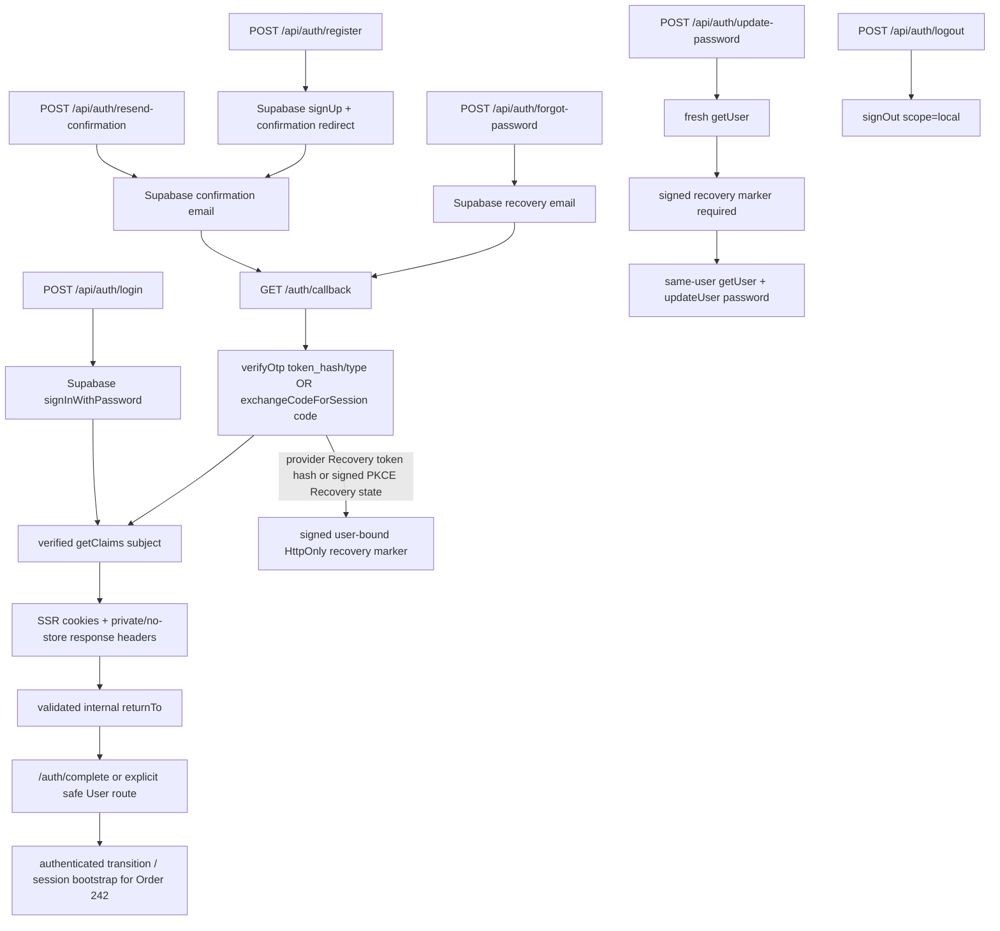

# Auth / Login Policy

Status: Current Production Auth contract. Order 190 selected the policy; Order 241 implements the Email + Password foundation; Order 251 adds Account lifecycle reauthentication and hard-delete boundaries.

Approved Product behavior comes from the Notion requirement **Account / Login / Guest Save**. `docs/user-data-architecture.md` owns user-data boundaries, `docs/user-data-access.md` owns the Account DAL/RLS boundary, and `docs/guest-save-sync-policy.md` owns the approved Guest Saved merge policy. Prototype Auth remains a UX reference only.

## 1. Current decision

| Topic | Current contract |
| --- | --- |
| Provider | Supabase Auth |
| MVP method | Email + Password |
| Identity | Supabase Auth UUID (`auth.users.id`) |
| Email confirmation | Required in STG and Production |
| Session | `@supabase/ssr` PKCE session in cookies |
| Normal identity check | verified `getClaims()` / `claims.sub` |
| Sensitive account check | fresh `getUser()` where immediate Auth state is required |
| Password | Provider is authoritative; application mirrors minimum 8 characters |
| Guest | No Supabase anonymous user for normal browsing or Guest Saved |
| Normal Auth credentials | Never stored in URL state or custom `localStorage` |
| Elevated access | Service-role/Admin Auth is prohibited from normal Login/Register/Recovery/User Data flows |

OAuth, Magic Link, Phone, MFA, Email change, and Production Admin authentication remain outside the current implementation. Account deletion is implemented by the isolated Order 251 lifecycle boundary, not by normal Auth flows.

## 2. Current implementation

Production now has these request-scoped boundaries:

| Boundary | File | Responsibility |
| --- | --- | --- |
| Browser client | `src/lib/supabase/client.ts` | Browser session client for future Client Components |
| Server-render client | `src/lib/supabase/server.ts` | Server Components and User Data DAL; not an Auth response writer |
| Middleware | `src/lib/supabase/middleware.ts`, root `middleware.ts` | Session verification/refresh and cookie/cache-header propagation |
| Route Handler client | `src/lib/supabase/route.ts` | Per-request Auth mutation/callback client; stages every SSR cookie and response/cache header for the final `NextResponse` |
| Auth service | `src/lib/auth/service.ts` | Typed Login/Register/confirmation/logout/recovery operations and verified transition results |
| Auth validation/errors | `src/lib/auth/validation.ts`, `src/lib/auth/errors.ts` | Password/email validation, safe `returnTo`, and provider-to-domain error mapping |

The browser client is the only module-global Supabase client, as intended for one browser runtime. Every server, middleware, mutation, and callback client is created per request. No server session, cookie, claims object, or Auth client is kept in process-global state.

The existing Admin client remains a separate elevated maintenance boundary. User Auth adoption does not make `/admin` a Production-authenticated surface.

## 3. Flow overview



`GET /auth/callback` is the single confirmation/recovery callback. It accepts exactly one of:

- `token_hash` plus an allowed email OTP `type`, then calls `verifyOtp()`; or
- a PKCE `code`, then calls `exchangeCodeForSession()`.

Both paths require a verified `claims.sub` before success. For PKCE, the mutable `intent` query is only a navigation hint and never proves Recovery purpose. Forgot Password creates a separate HMAC-authenticated `recovery_state`, bound to the normalized requested email; after code exchange the callback verifies that state against the fresh `getUser().email`. For token-hash callbacks, only the provider-verified `type=recovery` establishes Recovery purpose. The final redirect is rebuilt from the validated destination, so `code`, `token_hash`, and `recovery_state` are removed from the browser URL.

## 4. Route and result contract

| Route | Method | Provider operation | Success status |
| --- | --- | --- | --- |
| `/api/auth/login` | POST | `signInWithPassword()` | `authenticated` |
| `/api/auth/register` | POST | `signUp()` | `awaiting_email_confirmation`, or `authenticated` only when the provider returns and verifies an immediate session |
| `/api/auth/resend-confirmation` | POST | `resend({ type: "signup" })` | `confirmation_requested` |
| `/api/auth/forgot-password` | POST | `resetPasswordForEmail()` | `recovery_requested` |
| `/auth/callback` | GET | `verifyOtp()` or `exchangeCodeForSession()`; Recovery additionally requires provider `type=recovery` or signed email-bound PKCE state plus fresh `getUser()` | clean internal redirect after verified session; verified Recovery receives a signed user-bound purpose marker |
| `/auth/complete` | GET/UI | neutral Auth completion/error surface | default confirmation/Login callback landing and Order 242 handoff surface |
| `/api/auth/update-password` | POST | password validation, fresh `getUser()`, signed marker verification, same-user recheck, then `updateUser({ password })` | `password_updated`, then marker removal |
| `/api/auth/logout` | POST | `signOut({ scope: "local" })` | `signed_out` |
| `/auth/update-password` | GET/UI | fresh `getUser()` plus recovery marker | submits only to the guarded update-password route |
| `/api/account/export` | GET | fresh `getUser()` plus owner-RLS reads | private/no-store JSON attachment |
| `/api/account/reauthenticate` | POST | fresh `getUser()` then `signInWithPassword()` for the same confirmed identity | HMAC-authenticated, user-bound lifecycle marker |
| `/api/account/delete` | POST | marker + fresh `getUser()` + preconditions + server-only Admin hard delete | `account_deleted` |

JSON success and failure bodies contain only typed domain state. Passwords, tokens, cookies, provider messages, SQL text, stack traces, and account-existence hints are never returned.

The shared Auth visual integration is downstream. Order 241 does not copy the Prototype Login popup or its local account model into Production.

## 5. Registration and confirmation

Registration normalizes surrounding email whitespace and mirrors the eight-character password minimum for immediate feedback. Supabase Auth remains authoritative for email identity, uniqueness, password rules, hashing, and confirmation.

With confirmation enabled, `signUp()` normally returns no session. The application returns `awaiting_email_confirmation`; it never treats an Auth user object alone as an authenticated state. Duplicate/existing-account outcomes use the same neutral confirmation-wait contract.

The confirmation email must return to the allow-listed `/auth/callback` URL. The callback supports both current Supabase server-side email-template `token_hash` verification and PKCE code exchange. After either flow it verifies the resulting session and returns only to a safe internal path.

The default Auth completion destination is `/auth/complete`. It is a neutral Production Account surface and never falls through the root `/` route to the Admin landing page. A caller may still supply an explicitly validated internal User route through `returnTo`; no nonexistent Profile URL is hardcoded.

Invalid or expired callbacks also return to `/auth/complete?authError=<safe-code>`. Provider messages and callback credentials are not copied to that URL.

Terms/Privacy acceptance is not stored in Auth metadata. Order 251 implements the separate `user_legal_consents` table and trusted writer. Registration does not invoke it until Order 420 supplies final Terms/Privacy document versions.

## 6. Password recovery

```text
Forgot Password request
  -> neutral recovery_requested result
  -> allow-listed recovery email with signed email-bound callback state
  -> /auth/callback (token_hash or PKCE code)
  -> verified cookie session
  -> provider Recovery type OR valid PKCE callback state for fresh user email
  -> 15-minute HMAC recovery-purpose marker bound to fresh Auth UUID
  -> /auth/update-password
  -> marker + fresh getUser()
  -> updateUser({ password })
  -> recovery-purpose marker removed
```

Unknown-email recovery requests remain neutral. The same callback-state construction runs before the provider lookup and does not disclose whether the normalized email exists. Rate limiting and provider outages use stable safe errors. The update route accepts no `userId` or email as authorization proof and requires both a fresh authenticated user and the recovery-purpose marker. A normal Login session without the marker cannot use the recovery password endpoint.

The PKCE callback state uses the same dedicated `PASSWORD_RECOVERY_MARKER_SECRET` but a distinct versioned `password-recovery-callback` purpose and wire format from the 15-minute update marker. Its HMAC input includes the normalized requested email without placing the email in the state payload. The state payload contains only version, purpose, issue/expiry times, a random nonce, and signature. Server verification allows one hour, independently enforces issue/expiry time, and still requires the provider code to be valid; it does not extend the provider link lifetime. The repository-local Supabase config does not override `auth.email.otp_expiry`, whose current provider default is also 3,600 seconds, so LOCAL does not shorten a valid provider link. Order 260 must keep each deployed provider expiry and this application limit aligned. Missing configuration, unsigned `intent=recovery`, malformed/tampered/expired state, or a state issued for a different fresh Auth email fails closed and never creates the update marker.

The marker cookie is `muuzee-password-recovery-v1`. It is HMAC-SHA256 signed with the dedicated server-only `PASSWORD_RECOVERY_MARKER_SECRET`, which must contain at least 32 UTF-8 bytes and must not reuse Supabase credentials or the Account lifecycle secret. The payload contains only version, `password-recovery` purpose, issue/expiry times, a random nonce, and signature. The fresh Auth UUID participates in the signature input but is not stored in the cookie. Missing/invalid configuration and fixed, malformed, tampered, expired, wrong-purpose, unknown-version, or wrong-user markers fail closed.

The cookie remains HttpOnly, SameSite=Lax, `Path=/`, Secure in Production, and has a 15-minute `Max-Age`; server verification independently enforces the same 15-minute expiry. The root path is required because the marker is written by `/auth/callback`, read by both `/auth/update-password` and `/api/auth/update-password`, and cleared by `/api/auth/logout`. It contains no password, token, email, user ID, or account data. Callback handling clears any prior marker and sets it again only after a verified Recovery transition plus fresh user resolution; Login and signup confirmation never establish Recovery purpose.

Successful password update clears the marker. Retryable update failure leaves it available only for its remaining short lifetime, while Logout and other Auth transitions clear it regardless of provider result. The `/auth/update-password` Server Component can validate and redirect but cannot attach a cookie-clearing response. Therefore an invalid marker encountered only by that page remains inert until its cookie `Max-Age` expires or until the next Auth/API transition clears it; the mutation API always clears invalid markers in its own response. This is a cleanup boundary, not an authorization gap, because both page and mutation independently reject invalid markers server-side.

The recovery callback origin is derived from the incoming request origin, not a hardcoded environment domain. Each environment must explicitly allow that callback. The minimal `/auth/update-password` page is a verification surface, not the final shared Account UI.

## 7. Session, logout, and authorization

- Supabase owns access/refresh tokens, rotation, password hashes, and Auth server state.
- Muuzee adds no custom token, credential object, URL login flag, or localStorage session.
- Middleware refreshes/verifies cookie sessions on reload. User Data derives identity from verified `claims.sub` and remains protected by owner RLS.
- Route Handler mutations use the Response-aware adapter. It applies both cookies and the cache headers supplied by `@supabase/ssr` (`private/no-store`, `Expires`, and `Pragma`) to the exact returned `NextResponse`.
- Current-browser logout uses local scope and clears any recovery-purpose marker. It deletes no Account data and performs no reverse sync to Guest Saved.
- Authentication proves identity; authorization remains the Order 230 grants/RLS contract.

## 8. Safe `returnTo`

`resolveSafeReturnTo()` is the single pure validation boundary.

Accepted:

- `/path`
- `/path?x=1`

Rejected:

- absolute URLs and schemes;
- protocol-relative `//host` values, including encoded leading double slashes;
- backslashes, including encoded backslashes;
- control characters;
- Auth callback loops;
- malformed encodings.

Invalid input falls back to `/auth/complete`. Recovery email construction explicitly falls back to `/auth/update-password`. User input never becomes an absolute provider redirect or raw `Location` value.

## 9. Error and enumeration contract

| Code | Retryable | Safe meaning |
| --- | --- | --- |
| `invalid_input` | No | malformed email/password or provider-rejected input |
| `invalid_credentials` | No | generic Login failure; unknown email and wrong password are not distinguished |
| `rate_limited` | Yes | wait before retrying |
| `expired_or_invalid_link` | No | callback credential is missing, invalid, expired, or already unusable |
| `unauthenticated` | No | verified session/user context is absent |
| `temporary` | Yes | transient or unknown provider failure |

Registration duplicates return the same `awaiting_email_confirmation` state as a confirmation-required registration. Forgot Password and unknown-account resend behavior are neutral. Provider `message`, token values, account lookup details, and internal errors stay server-side.

## 10. Order 242 handoff

Order 241 exposes two intentionally small authenticated-session boundaries:

1. Login/immediate-session registration returns `{ status: "authenticated", transition: { type: "authenticated", source } }` only after verified `claims.sub` exists.
2. Confirmation/recovery callbacks establish the cookie session, then redirect to a clean internal URL. `/auth/complete` is the neutral default surface where Order 242 now verifies authenticated state plus a non-empty Guest store and performs the merge. On reload, middleware plus the normal browser/server Supabase session bootstrap resolves the same authenticated state.

Order 242 may run Guest Saved merge only when:

```text
verified authenticated state
AND
guest store contains valid refs
```

The Order 242 implementation connects `/auth/complete` and exports `GuestSavedMergeBootstrap` for the future authenticated User Front shell. The broad shell is not present yet, so the bootstrap is intentionally not mounted globally and no claim is made that every Production page retries merge on restore. Future in-page Login UI can call the same single-flight orchestrator after an authenticated transition. No custom event bus is used.

## 11. Environment dependencies

No dashboard or remote environment setting is changed by Order 241. `docs/environment-strategy.md` is the approved environment-policy Source of Truth; downstream environment Orders own remote provisioning.

| Setting | LOCAL | STG | Production |
| --- | --- | --- | --- |
| Site URL | local Next.js origin | exact stable STG HTTPS origin | exact canonical HTTPS origin |
| Redirect allowlist | exact local `/auth/callback` URLs | exact STG `/auth/callback` URL | exact Production `/auth/callback` URL; no wildcard |
| Email confirmation | enabled for Product-equivalent Mailpit testing | required | required |
| Email delivery | Supabase CLI Mailpit | approved sandbox SMTP | approved Production SMTP |
| Password minimum | mirror 8 in app; provider config is authoritative | configure at least 8 | configure at least 8 |
| Email OTP/link expiry | 3,600 seconds | 3,600 seconds | 3,600 seconds |
| Leaked-password protection | plan-dependent local behavior | enable when available/approved | enable when available/approved |
| Keys | public URL/anon key plus separate local marker secrets | STG-only secret store values | Production-only secret store values; service role remains server-only |

The repository-local `supabase/config.toml` explicitly mirrors the eight-character minimum and 3,600-second email-link expiry, disables anonymous sign-in, and allow-lists only the localhost callback variants used by the app. Applying those settings to an already-running local stack requires a normal stop/start; it does not require a database reset. Order 260 defines the approved environment policy. Orders 270–340 provision the hosted environment, redirect, rate-limit, and secret settings; Order 410 owns SMTP selection; Order 460 owns monitoring/operations; a hosted Auth setup or separate Security task owns CAPTCHA only if the launch decision adopts it.

## 12. Deferred scope

- Guest Saved adapter/merge/cleanup: Order 242.
- Account Settings UI and Registration consent capture remain downstream; the Order 251 persistence and lifecycle server boundaries are implemented.
- STG/Production Auth and redirect operations: Orders 270/300 and 310/340; SMTP selection: Order 410; environment secrets: Orders 290/330.
- OAuth, passwordless, Phone, MFA, Email change, all-device logout, and final shared Auth UI: Future/downstream.
- Account deletion: Order 251 implements fresh password reauthentication, optional JSON export, fail-closed avatar handling, privileged hard deletion, database cascades, best-effort local sign-out, and lifecycle-marker cleanup. The 15-minute marker is HMAC-SHA256 signed with the dedicated `ACCOUNT_LIFECYCLE_MARKER_SECRET`; signature verification includes the fresh Auth UUID without placing it or credentials in the cookie payload. Missing configuration, malformed/tampered/expired markers, and markers issued for another user fail closed. A real avatar Storage adapter remains future work; completed deletion is irreversible and is not restored by Product, Support, or backup/PITR.

## Official evidence

Official Supabase and Next.js sources checked for Order 241:

- [Supabase Server-Side Rendering](https://supabase.com/docs/guides/auth/server-side)
- [Creating a Supabase client for SSR](https://supabase.com/docs/guides/auth/server-side/creating-a-client?framework=nextjs)
- [Advanced SSR guide](https://supabase.com/docs/guides/auth/server-side/advanced-guide)
- [Password-based Auth](https://supabase.com/docs/guides/auth/passwords)
- [Supabase CLI config (`auth.email.otp_expiry`)](https://supabase.com/docs/guides/local-development/cli/config)
- [Email Templates](https://supabase.com/docs/guides/auth/auth-email-templates)
- [Redirect URLs](https://supabase.com/docs/guides/auth/redirect-urls)
- [JavaScript Auth API](https://supabase.com/docs/reference/javascript/auth-signinwithpassword)
- [Next.js cookies](https://nextjs.org/docs/app/api-reference/functions/cookies)
- [Next.js `NextResponse`](https://nextjs.org/docs/app/api-reference/functions/next-response)
