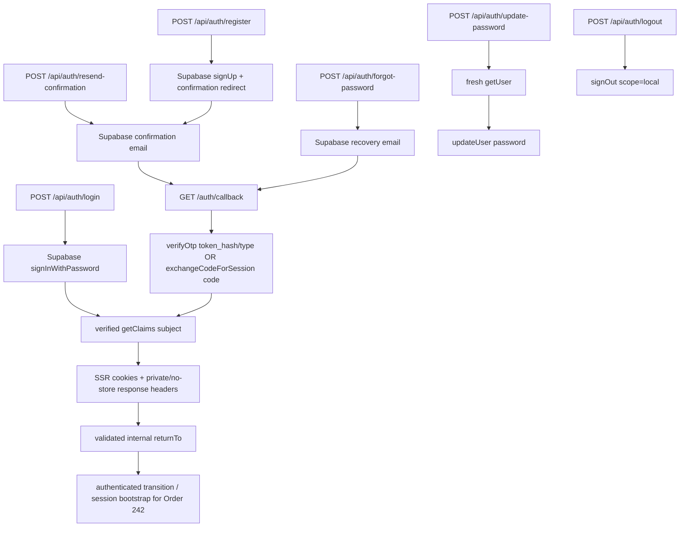

# Auth / Login Policy

Status: Current Production Auth contract. Order 190 selected the policy; Order 241 implements the Email + Password mutation, callback, session, logout, and recovery foundation.

Approved Product behavior comes from the Notion requirement **Account / Login / Guest Save**. `docs/user-data-architecture.md` owns user-data boundaries, `docs/user-data-access.md` owns the Account DAL/RLS boundary, and `docs/guest-save-sync-policy.md` owns the approved Guest Saved merge policy. Prototype Auth remains a UX reference only.

## 1. Current decision

| Topic | Current contract |
| --- | --- |
| Provider | Supabase Auth |
| MVP method | Email + Password |
| Identity | Supabase Auth UUID (`auth.users.id`) |
| Email confirmation | Required in STG and Production |
| Session | `@supabase/ssr` PKCE session in cookies |
| Normal identity check | verified `getClaims()` / `claims.sub` |
| Sensitive account check | fresh `getUser()` where immediate Auth state is required |
| Password | Provider is authoritative; application mirrors minimum 8 characters |
| Guest | No Supabase anonymous user for normal browsing or Guest Saved |
| Normal Auth credentials | Never stored in URL state or custom `localStorage` |
| Elevated access | Service-role/Admin Auth is prohibited from normal Login/Register/Recovery/User Data flows |

OAuth, Magic Link, Phone, MFA, Email change, Account deletion, and Production Admin authentication are not part of Order 241.

## 2. Current implementation

Production now has these request-scoped boundaries:

| Boundary | File | Responsibility |
| --- | --- | --- |
| Browser client | `src/lib/supabase/client.ts` | Browser session client for future Client Components |
| Server-render client | `src/lib/supabase/server.ts` | Server Components and User Data DAL; not an Auth response writer |
| Middleware | `src/lib/supabase/middleware.ts`, root `middleware.ts` | Session verification/refresh and cookie/cache-header propagation |
| Route Handler client | `src/lib/supabase/route.ts` | Per-request Auth mutation/callback client; stages every SSR cookie and response/cache header for the final `NextResponse` |
| Auth service | `src/lib/auth/service.ts` | Typed Login/Register/confirmation/logout/recovery operations and verified transition results |
| Auth validation/errors | `src/lib/auth/validation.ts`, `src/lib/auth/errors.ts` | Password/email validation, safe `returnTo`, and provider-to-domain error mapping |

The browser client is the only module-global Supabase client, as intended for one browser runtime. Every server, middleware, mutation, and callback client is created per request. No server session, cookie, claims object, or Auth client is kept in process-global state.

The existing Admin client remains a separate elevated maintenance boundary. User Auth adoption does not make `/admin` a Production-authenticated surface.

## 3. Flow overview



`GET /auth/callback` is the single confirmation/recovery callback. It accepts exactly one of:

- `token_hash` plus an allowed email OTP `type`, then calls `verifyOtp()`; or
- a PKCE `code`, then calls `exchangeCodeForSession()`.

Both paths require a verified `claims.sub` before success. The final redirect is rebuilt from the validated destination, so `code` and `token_hash` are removed from the browser URL.

## 4. Route and result contract

| Route | Method | Provider operation | Success status |
| --- | --- | --- | --- |
| `/api/auth/login` | POST | `signInWithPassword()` | `authenticated` |
| `/api/auth/register` | POST | `signUp()` | `awaiting_email_confirmation`, or `authenticated` only when the provider returns and verifies an immediate session |
| `/api/auth/resend-confirmation` | POST | `resend({ type: "signup" })` | `confirmation_requested` |
| `/api/auth/forgot-password` | POST | `resetPasswordForEmail()` | `recovery_requested` |
| `/auth/callback` | GET | `verifyOtp()` or `exchangeCodeForSession()` | clean internal redirect after verified session |
| `/api/auth/update-password` | POST | fresh `getUser()`, then `updateUser({ password })` | `password_updated` |
| `/api/auth/logout` | POST | `signOut({ scope: "local" })` | `signed_out` |
| `/auth/update-password` | GET/UI | minimal recovery-session verification surface | submits only to the typed update-password route |

JSON success and failure bodies contain only typed domain state. Passwords, tokens, cookies, provider messages, SQL text, stack traces, and account-existence hints are never returned.

The shared Auth visual integration is downstream. Order 241 does not copy the Prototype Login popup or its local account model into Production.

## 5. Registration and confirmation

Registration normalizes surrounding email whitespace and mirrors the eight-character password minimum for immediate feedback. Supabase Auth remains authoritative for email identity, uniqueness, password rules, hashing, and confirmation.

With confirmation enabled, `signUp()` normally returns no session. The application returns `awaiting_email_confirmation`; it never treats an Auth user object alone as an authenticated state. Duplicate/existing-account outcomes use the same neutral confirmation-wait contract.

The confirmation email must return to the allow-listed `/auth/callback` URL. The callback supports both current Supabase server-side email-template `token_hash` verification and PKCE code exchange. After either flow it verifies the resulting session and returns only to a safe internal path.

The current registration fallback is `/`, because a Production Profile Settings destination is not yet available. The existing root route currently redirects to the Admin landing page; User Front integration must supply a valid internal `returnTo` once its destination exists. No nonexistent Profile URL is hardcoded.

Terms/Privacy acceptance is not stored in Auth metadata. `user_legal_consents` remains an Order 250 dependency and is not implemented by Order 241.

## 6. Password recovery

```text
Forgot Password request
  -> neutral recovery_requested result
  -> allow-listed recovery email
  -> /auth/callback (token_hash or PKCE code)
  -> verified cookie session
  -> /auth/update-password
  -> fresh getUser()
  -> updateUser({ password })
```

Unknown-email recovery requests remain neutral. Rate limiting and provider outages use stable safe errors. The update route accepts no `userId` or email as authorization proof and refuses a missing/invalid authenticated session.

The recovery callback origin is derived from the incoming request origin, not a hardcoded environment domain. Each environment must explicitly allow that callback. The minimal `/auth/update-password` page is a verification surface, not the final shared Account UI.

## 7. Session, logout, and authorization

- Supabase owns access/refresh tokens, rotation, password hashes, and Auth server state.
- Muuzee adds no custom token, credential object, URL login flag, or localStorage session.
- Middleware refreshes/verifies cookie sessions on reload. User Data derives identity from verified `claims.sub` and remains protected by owner RLS.
- Route Handler mutations use the Response-aware adapter. It applies both cookies and the cache headers supplied by `@supabase/ssr` (`private/no-store`, `Expires`, and `Pragma`) to the exact returned `NextResponse`.
- Current-browser logout uses local scope. It deletes no Account data and performs no reverse sync to Guest Saved.
- Authentication proves identity; authorization remains the Order 230 grants/RLS contract.

## 8. Safe `returnTo`

`resolveSafeReturnTo()` is the single pure validation boundary.

Accepted:

- `/path`
- `/path?x=1`

Rejected:

- absolute URLs and schemes;
- protocol-relative `//host` values, including encoded leading double slashes;
- backslashes, including encoded backslashes;
- control characters;
- Auth callback loops;
- malformed encodings.

Invalid input falls back to a known internal destination. User input never becomes an absolute provider redirect or raw `Location` value.

## 9. Error and enumeration contract

| Code | Retryable | Safe meaning |
| --- | --- | --- |
| `invalid_input` | No | malformed email/password or provider-rejected input |
| `invalid_credentials` | No | generic Login failure; unknown email and wrong password are not distinguished |
| `rate_limited` | Yes | wait before retrying |
| `expired_or_invalid_link` | No | callback credential is missing, invalid, expired, or already unusable |
| `unauthenticated` | No | verified session/user context is absent |
| `temporary` | Yes | transient or unknown provider failure |

Registration duplicates return the same `awaiting_email_confirmation` state as a confirmation-required registration. Forgot Password and unknown-account resend behavior are neutral. Provider `message`, token values, account lookup details, and internal errors stay server-side.

## 10. Order 242 handoff

Order 241 exposes two intentionally small authenticated-session boundaries:

1. Login/immediate-session registration returns `{ status: "authenticated", transition: { type: "authenticated", source } }` only after verified `claims.sub` exists.
2. Confirmation/recovery callbacks establish the cookie session, then redirect to a clean internal URL. On reload, middleware plus the normal browser/server Supabase session bootstrap resolves the same authenticated state.

Order 242 may run Guest Saved merge only when:

```text
verified authenticated state
AND
guest store contains valid refs
```

It may react to the explicit mutation result for in-page Login, and to normal session bootstrap/auth-state observation after callback or reload. No custom event bus is required. Order 241 does not implement the Guest adapter, merge, cleanup, or retry orchestration.

## 11. Environment dependencies

No dashboard or remote environment setting is changed by Order 241.

| Setting | LOCAL | STG / Production |
| --- | --- | --- |
| Site URL | local Next.js origin | environment/canonical HTTPS origin |
| Redirect allowlist | exact local `/auth/callback` URL | exact environment `/auth/callback` URL; avoid broad wildcard use |
| Email confirmation | `supabase/config.toml` enables it for Product-equivalent Mailpit testing | required |
| Email delivery | Supabase CLI Mailpit | approved sandbox in STG; custom SMTP in Production |
| Password minimum | mirror 8 in app; provider config is authoritative | configure at least 8 in provider |
| Leaked-password protection | plan-dependent local behavior | enable when available/approved |
| Keys | public URL/anon key for normal flow | environment secret store; service role remains server-only and unused here |

The repository-local `supabase/config.toml` also mirrors the eight-character minimum, disables anonymous sign-in, and allow-lists only the localhost callback variants used by the app. Applying those settings to an already-running local stack requires a normal stop/start; it does not require a database reset. Order 260 owns final environment policy, domains, hosted redirect allowlists, SMTP, rate-limit/CAPTCHA, monitoring, and secret rotation.

## 12. Deferred scope

- Guest Saved adapter/merge/cleanup: Order 242.
- Legal consent persistence and account lifecycle policy: Order 250 and later implementation.
- STG/Production Auth/SMTP/redirect operations: Order 260.
- OAuth, passwordless, Phone, MFA, Email change, all-device logout, and final shared Auth UI: Future/downstream.
- Account deletion: requires retention, reauthentication, Storage cleanup, and privileged server orchestration; it is not implemented here.

## Official evidence

Official Supabase and Next.js sources checked for Order 241:

- [Supabase Server-Side Rendering](https://supabase.com/docs/guides/auth/server-side)
- [Creating a Supabase client for SSR](https://supabase.com/docs/guides/auth/server-side/creating-a-client?framework=nextjs)
- [Advanced SSR guide](https://supabase.com/docs/guides/auth/server-side/advanced-guide)
- [Password-based Auth](https://supabase.com/docs/guides/auth/passwords)
- [Email Templates](https://supabase.com/docs/guides/auth/auth-email-templates)
- [Redirect URLs](https://supabase.com/docs/guides/auth/redirect-urls)
- [JavaScript Auth API](https://supabase.com/docs/reference/javascript/auth-signinwithpassword)
- [Next.js cookies](https://nextjs.org/docs/app/api-reference/functions/cookies)
- [Next.js `NextResponse`](https://nextjs.org/docs/app/api-reference/functions/next-response)
