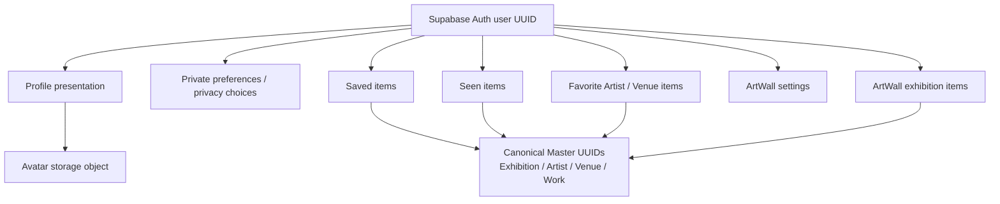

# User Data Architecture

Status: Current Production user-data architecture overview. Originally written for Order 180; reconciled after Orders 190, 195, 200, 210, 215, and 220.

This document explains ownership and durable architecture. It is not the exact schema, migration, or Data Access Source of Truth. Approved product behavior comes from the Notion requirement **Account / Login / Guest Save** and the confirmed Order 80 Public DTO contract. Prototype files are observations only; they are not schema specifications.

## 0. Current Contract / Supersession

When this document conflicts with a more specific current artifact, use these Sources of Truth:

- Target Schema v1: `docs/database/user-data-target.json`
- Current Physical Schema: forward SQL under `supabase/migrations/`
- User Data Access: `docs/user-data-access.md`
- Auth/session policy: `docs/auth-login-policy.md`

The Candidate Data Model and comparison rationale later in this document are retained as **historical Order 180 design context**. They do not reopen decisions locked by Order 195 or replace implemented migrations.

Current MVP decisions are:

| Domain | Current contract |
| --- | --- |
| Saved | Current set membership for Exhibition, Artist, Venue, and Work |
| Seen | Authenticated current set membership for Exhibition, Artist, Venue, and Work; separate from repeatable Visit history |
| Favorite | MVP current set membership for Artist and Venue only; distinct from Saved |
| Preferences | Notification, Newsletter, and private Location fields are adopted; delivery and Location consumers remain downstream |
| ArtWall | Six typed settings are persisted; current candidates are Seen Exhibitions; selected membership/order/visibility remain separate state |
| `user_visits` | Future / excluded from Target v1; not synonymous with Seen |
| Legal Consent | `user_legal_consents` is Target v1 Planned but has no Physical table; migration waits for Order 250 |

The current Physical Schema contains seven User Data tables: `profiles`, `user_preferences`, `user_saved_items`, `user_seen_items`, `user_favorite_items`, `user_artwall_settings`, and `user_artwall_items`. All seven have RLS enabled and zero policies pending Order 230.

## 1. Goals / Non-goals

### Goals

- Separate Supabase Auth identity from Muuzee profile presentation and preferences.
- Define ownership and canonical identifiers for Saved, Seen, Favorite, and ArtWall data.
- Keep all personal relations keyed by Muuzee Master UUIDs rather than display names, titles, slugs, or image URLs.
- Preserve the approved boundary that a guest can Save and open Saved without creating an Account DB row.
- Give Orders 190, 200, 210, 220, 230, and 240 stable ownership and access boundaries.
- Make every authenticated user-owned row compatible with owner-based RLS and account deletion.

### Non-goals

- Replacing the Target Schema or migration-derived Physical Schema.
- Reopening Auth, Personal Action, Preferences, or ArtWall decisions already locked downstream.
- Implementing Guest Save storage or its Account merge algorithm; Order 240 owns those details.
- Implementing owner RLS policies; Order 230 owns authorization policies and integration tests.
- Connecting `prototype/` to Supabase or treating prototype localStorage structures as Production contracts.

## 2. Domain Boundary

Production user data is divided into five responsibilities.

| Boundary | Owns | Does not own |
| --- | --- | --- |
| Auth Identity | Auth user UUID, login email, providers, credentials, recovery, session, auth lifecycle | Display name, avatar presentation, Saved, Seen, Favorite, ArtWall |
| Profile / Preferences | Muuzee-facing profile presentation, private preferences, privacy choices | Credentials or a duplicate login email |
| Personal Actions | Saved, Seen, and Favorite state linked to canonical masters | Master display fields or public content publication |
| My Art / ArtWall | Presentation settings and selected Exhibition membership/order | Seen history itself, copied Exhibition objects, persisted derived counts |
| Canonical Master Data | Exhibition, Artist, Venue, Work identity and display data | Viewer-specific action state |

`prototype/` remains a fixture and interaction reference. Production persistence and data access live under `src/` and Supabase.

## 3. Ownership Model

The Production user identity key is the Auth provider user UUID. With Supabase Auth, authenticated user-owned tables reference `auth.users.id` as `user_id`. A second Muuzee credential/user identity table is not required for MVP.



Ownership rules:

- Auth user deletion owns deletion of Profile, Preferences, authenticated Personal Actions, and ArtWall rows.
- Profile owns the reference to an avatar object; object deletion needs explicit Storage cleanup because a database cascade does not delete Storage objects.
- Master entities are referenced, not owned, by Personal Actions and ArtWall.
- My Art is a read composition of Profile, Personal Actions, ArtWall, and derived stats. It is not one table.

## 4. Auth vs Profile

### Auth-owned identity

- `user_id` / Auth UUID
- login email
- provider identity
- password, recovery, MFA if introduced
- session and token lifecycle
- auth account deletion lifecycle

Auth remains the Source of Truth for credential and login email. Production must not copy the prototype `email` field into `profiles` as a second credential field.

### Profile presentation

Current MVP Profile fields are deliberately small:

- `display_name`
- `avatar_object_path`
- timestamps

`avatar_object_path` is a Storage object reference/path, not Base64 and not an expiring signed URL. A candidate Production location is a user-namespaced object in a `profile-avatars` bucket. Bucket access, transformation, and cleanup implementation belong to Order 200 and the account-deletion flow.

### Preferences and private metadata

Preferences are separate from Profile presentation. The MVP schema adopts:

- `notification_enabled`
- `newsletter_enabled`
- private `country_code`, `region`, `prefecture`, and `city`

Notification delivery, Newsletter delivery, and Search/Map Location consumption remain downstream. Location is private by default and must not enter a public profile DTO without a separate opt-in decision. Auditable Terms/Privacy consent is a separate planned domain, not the Newsletter boolean.

## 5. Guest vs Authenticated

| Capability | Guest | Authenticated |
| --- | --- | --- |
| Save Exhibition / Venue / Artist / Work | Client-owned persistent state | DB-owned user state |
| Open and remove items from Saved | Yes | Yes |
| Seen | No | Yes; current membership for Exhibition, Artist, Venue, and Work |
| Favorite / 推し | No | Yes; Artist and Venue only, distinct from Saved |
| Profile / Preferences | No | Yes |
| My Art / ArtWall persistence | No | Yes |

### Guest Save boundary

- Guest Save must not require an Auth user or Account DB row.
- Guest records carry only an entity kind plus canonical Master UUID. Display data is hydrated from the Master read contract.
- The guest persistence adapter must be replaceable without changing UI action semantics.

Candidate storage comparison:

| Candidate | Strength | Cost / risk | Order 180 position |
| --- | --- | --- | --- |
| localStorage | Smallest MVP implementation, durable per browser, already proven in prototype | Synchronous, device-local, limited structure | Leading MVP candidate, not finalized |
| IndexedDB | Structured and asynchronous; better for larger offline data | More lifecycle and migration complexity than Saved IDs need | Use only if Order 240 identifies a concrete need |
| guest cookie/session identifier + server rows | Cross-request server identity can support richer sync | Introduces anonymous server ownership, retention, consent, and abuse controls | Not required by the approved Guest Save boundary |

### Guest to Account

Order 180 fixes the input contract only: both guest and authenticated Saved state identify items by canonical entity kind and UUID. Order 240 owns merge timing, idempotency, clearing/retaining the guest store, and conflict behavior. The expected baseline is set union/deduplication by canonical ID, but it is not finalized here.

### Logout

- Logout never deletes account-owned data.
- Account Saved, Seen, Favorite, Profile, and ArtWall remain server-side.
- After logout, account state is no longer exposed to the viewer.
- If device-local Guest Saved state exists, Guest Saved may become visible again. Whether guest state is cleared after a successful merge is delegated to Order 240.

## 6. Personal Action Matrix

| Action | Product meaning | Current targets | Auth boundary | Persistence shape | Status |
| --- | --- | --- | --- | --- | --- |
| Saved | Keep content for later access | Exhibition, Venue/Museum, Artist, Work | Guest + authenticated | Current set membership; one row per user/entity for accounts | MVP adopted |
| Seen / 観た | Personal acknowledgement distinct from repeatable Visit history | Exhibition, Venue/Museum, Artist, Work | Authenticated only | Current set membership; one row per user/entity with `seen_at` | MVP adopted |
| Favorite / 推し | Strong affinity distinct from Saved | Artist, Venue/Museum | Authenticated only | Current set membership; separate table from Saved | MVP adopted |

### Seen boundary

Seen is not Guest state and remains separate from ArtWall membership. MVP uses one current membership row per user/entity for Exhibition, Artist, Venue, and Work, with `seen_at`. Repeatable visits are a different future capability represented by a possible `user_visits` domain; they are not inferred from or stored as duplicate Seen rows.

### Favorite boundary

Favorite is not a Saved alias. MVP adopts `user_favorite_items` for Artist and Venue only. Exhibition and Work are invalid Favorite targets. Public exposure and downstream notification use remain separate decisions.

## 7. Historical Order 180 Data-Model Rationale

This section preserves the conceptual model used to reach Target v1. It is historical rationale, not the exact current schema. For current columns, checks, indexes, and implementation status, use `docs/database/user-data-target.json` and `supabase/migrations/*.sql`. Auth-owned foreign keys cascade on account deletion. Master foreign keys use `RESTRICT` for hard delete so a canonical entity cannot silently disappear from user history; archive/unpublish remains the normal Master lifecycle.

### `profiles`

| Field / rule | Candidate contract |
| --- | --- |
| Primary key | `user_id` |
| User relation | `user_id → auth.users.id`, one-to-one, `ON DELETE CASCADE` |
| Fields | `display_name`, `avatar_object_path`, `created_at`, `updated_at` |
| Excluded | credential email, provider, password/recovery fields |

### `user_preferences`

| Field / rule | Candidate contract |
| --- | --- |
| Primary key | `user_id` |
| User relation | `user_id → auth.users.id`, one-to-one, `ON DELETE CASCADE` |
| MVP fields | `notification_enabled`, `newsletter_enabled`, `country_code`, `region`, `prefecture`, `city` |
| Default exposure | private |

### `user_saved_items`

| Field / rule | Candidate contract |
| --- | --- |
| Primary key | UUID `id` |
| Owner | required `user_id → auth.users.id`, `ON DELETE CASCADE` |
| Entity references | nullable `exhibition_id`, `artist_id`, `venue_id`, `work_id` |
| Integrity | exactly one entity FK is non-null |
| Uniqueness | partial unique key for each `(user_id, entity_id)` target |
| Timestamps | `created_at`; update timestamp is unnecessary for set membership unless later required |
| Master delete | `RESTRICT` |
| Query index | `(user_id, created_at desc)` plus target FK indexes |

### `user_seen_items`

| Field / rule | Candidate contract |
| --- | --- |
| Primary key | UUID `id` |
| Owner | required `user_id → auth.users.id`, `ON DELETE CASCADE` |
| Entity references | nullable `exhibition_id`, `artist_id`, `venue_id`, `work_id` |
| Integrity | exactly one entity FK is non-null |
| State | one current-membership row per user/entity with `seen_at` |
| Visit history | separate Future `user_visits` domain; excluded from Target v1 |
| Master delete | `RESTRICT` |

### `user_favorite_items`

| Field / rule | Candidate contract |
| --- | --- |
| MVP adoption | included for Artist and Venue only |
| Primary key / owner | UUID `id`; required `user_id`, `ON DELETE CASCADE` |
| Entity references | explicit nullable Master FKs for approved targets only |
| Integrity / uniqueness | exactly one entity FK; one current Favorite per user/entity |
| Master delete | `RESTRICT` |

### `user_artwall_settings`

MVP uses one ArtWall presentation per authenticated user. The table uses `user_id` as its primary key and account-deletion cascade boundary. The six adopted persisted settings are:

- `show_icon`
- `title`
- `comment`
- `background_key`
- `columns`
- `wall_height_mode`
- `created_at`, `updated_at`

These six fields are approved in Target v1 and implemented with explicit columns/checks rather than an unconstrained JSON settings bag.

### `user_artwall_items`

| Field / rule | Candidate contract |
| --- | --- |
| Primary key | UUID `id` |
| Owner | required `user_id → auth.users.id`, `ON DELETE CASCADE` |
| Membership | required `exhibition_id → exhibitions.id`, `ON DELETE RESTRICT` |
| Uniqueness | one `(user_id, exhibition_id)` row |
| Ordering | integer `sort_order`; deterministic read order is `sort_order, id` |
| Visibility | `is_visible` preserves a selected item while hiding it from the wall |
| Timestamps | `created_at`, `updated_at` |
| Query index | `(user_id, sort_order, id)` |

`sort_order` does not need to be globally unique. Avoiding a uniqueness constraint permits simple transactional reorder updates; deterministic `id` tie-breaking prevents unstable reads.

### Why separate action tables

Two designs were compared:

| Concern | Separate `user_saved_items` / `user_seen_items` / `user_favorite_items` | Generic `user_entity_actions` |
| --- | --- | --- |
| RLS | Direct owner policy per action | Direct owner policy but broader mixed-purpose table |
| Uniqueness | Matches each action's semantics | Conditional uniqueness across action types |
| Indexes / queries | Small, action-specific indexes and simple reads | Every query filters `action_type`; indexes become composite/conditional |
| Action-specific fields | Seen timestamps/history can evolve independently | Nullable action-specific columns or JSON are likely |
| Guest merge | Saved merge stays isolated | Merge must protect unrelated action types |
| Migration | More tables, clearer constraints | Fewer tables, more generic constraints and coupling |

Recommendation: separate tables by action. Saved, Seen, and Favorite have different Product meaning and lifecycle. A generic table reduces table count but increases conditional constraints and makes future Seen history harder.

Within each action table, explicit nullable Master FKs plus an exactly-one check are preferred over `entity_type + entity_id`. This preserves database FK integrity and follows the current Master Data architecture. Creating one table per action *and* per entity would provide the strongest simple FKs but multiplies repositories, RLS policies, and guest merge paths without a current need.

## 8. ArtWall Persistence

ArtWall is composed from four layers:

```text
Seen Exhibition source
        ↓ derive candidates
User-selected ArtWall membership and order
        +
ArtWall presentation settings
        ↓ hydrate by canonical Exhibition UUID
Visual ArtWall + derived stats
```

- Source history and ArtWall membership are separate. Removing an item from the wall does not erase Seen history.
- Membership rows reference canonical Exhibition UUIDs only.
- Exhibition title, image URL, Venue name, or fixture order must not be copied into user tables.
- Rendering hydrates current public display data from the canonical Exhibition read model.
- ArtWall membership/order uses relation rows, not a JSON UUID array. Rows preserve FK integrity, support RLS and per-item updates, and make hidden membership explicit.
- ArtWall stats are calculated from Personal Actions plus canonical relations. MVP does not create a duplicated `user_stats` table.
- If performance later requires a cache/materialized projection, it must be rebuildable and never become the ownership Source of Truth.

## 9. Canonical Master References

Personal tables use UUID foreign keys to:

- `exhibitions.id`
- `artists.id`
- `venues.id` for the Museum UI concept
- `works.id`

They never use title, name, slug, external source ID, or image URL as a relation key. Slugs remain URL identifiers and can change independently of user relations. Display values always come from Master DTOs.

Public Content and Viewer State remain separate contracts:

```text
Public Content DTO (cacheable canonical content)
        +
ViewerEntityStateDTO (guest or authenticated actions keyed by UUID)
        ↓
UI
```

Public DTOs must not gain `isSaved`, `isSeen`, or `isFavorite` fields. The viewer-state layer composes those flags at the application boundary.

## 10. Delete / Retention

### Account deletion

1. Authenticate and authorize the deletion request.
2. Delete or schedule deletion of the user's avatar Storage objects.
3. Delete the Auth user through the approved privileged account lifecycle.
4. `ON DELETE CASCADE` removes Profile, Preferences, Personal Actions, ArtWall settings, and ArtWall items.
5. Verify no user-owned rows or avatar objects remain, subject to a separately approved legal/audit retention policy.

Logout is not deletion and performs none of these steps.

### Master lifecycle

- Archive/unpublish is preferred to hard deletion and leaves UUID integrity intact.
- Personal action and ArtWall FKs use `RESTRICT` for hard delete in the candidate model.
- A personal list may need an unavailable/archived state rather than silently dropping an item; the exact UX is an Open Decision.
- Admin destructive deletion must account for user references before a future hard-delete operation is allowed.

### Guest retention

Guest Saved state is owned by the browser/device, not by an Auth account. Account deletion therefore does not automatically clear unrelated device-local Guest Saved state. Order 240 must define local expiry, clear controls, and post-merge retention.

## 11. Privacy / RLS Implications

| Data | Default | Future exposure |
| --- | --- | --- |
| Saved | Private | No public scope approved |
| Seen | Private | No public scope approved |
| Favorite | Private | MVP meaning/targets are fixed; no public scope approved |
| Preferences / location | Private | Location requires explicit field-level Product/privacy decision |
| Profile display name / avatar | Private to authenticated experience until a public profile contract exists | Potential public opt-in |
| ArtWall | Private | Public sharing is an explicit future opt-in decision |

Every authenticated user-owned table has a direct `user_id` so Order 230 can implement owner policies equivalent to `auth.uid() = user_id`. User Front access must not depend on a service-role client. Privileged service-role operations are limited to server-only account lifecycle or controlled maintenance paths.

Child rows should not rely solely on an application-supplied owner. Inserts/updates must be checked by RLS, and any server repository must derive the viewer user ID from the authenticated session rather than accepting an arbitrary client `user_id`.

## 12. Data Access Boundary

Production UI does not know Supabase table names or joins. The current responsibility split is:

```text
src/lib/user/
  types.ts       typed DTO/input contracts
  errors.ts      sanitized domain errors
  repository.ts  Supabase table/query/raw-row ownership
  service.ts     verified identity, validation and composition

src/lib/supabase/
  browser/server/middleware user-session clients

future Server Actions / Route Handlers
  consumer transport boundary after owner RLS is implemented
```

Order 220 implements this Account DAL. Its fixed contract is:

- read viewer state by a bounded set of canonical IDs;
- create/remove Saved and approved Personal Actions idempotently;
- read/update Profile, Preferences, and ArtWall through domain functions;
- keep Guest persistence outside this Account DAL while retaining the same canonical EntityRef semantics;
- return typed domain/DTO values rather than raw database rows;
- map Loading / Empty / Error / Retry behavior at the consumer boundary.

## 13. Implementation / Dependency Status

| Order | Current result / remaining responsibility |
| --- | --- |
| 190 Auth | Done: Supabase Auth UUID, cookie SSR, and Guest boundary are fixed |
| 195 Schema Lock | Done: `docs/database/user-data-target.json` is Target v1 Source of Truth |
| 200 Profile | Done: `profiles` and `user_preferences` Physical tables plus Auth bootstrap |
| 210 Personal Actions | Done: Saved, Seen, and Favorite Physical tables with locked target scopes |
| 215 ArtWall | Done: settings/items Physical tables; Seen Exhibition is the current source |
| 220 Data Access | Implemented on task branch: typed Account DAL, Viewer State, safe errors, SSR client foundation |
| 230 RLS | Pending: owner policies and owner/cross-user/anonymous integration tests |
| 240 Guest merge | Pending: Guest store, expiry, idempotent Account merge, cleanup and logout behavior |
| 250 Legal Consent | Pending: approve retention/delete/export policy before `user_legal_consents` migration |

## 14. Remaining Downstream Decisions

The following remain explicit downstream questions. Resolved Target v1 decisions for Seen, Favorite, Preferences, and the six ArtWall settings are not part of this list:

1. Public Profile scope and which fields can be exposed.
2. Private Location collection purpose, granularity, retention, and Search/Map default behavior.
3. ArtWall initial generation rule and maximum item count.
4. Guest Save storage implementation, expiry, clear behavior, cross-device expectations, and post-merge/logout behavior.
5. UX for Personal Actions that reference archived/unpublished Masters.
6. Whether public/shared ArtWall becomes a future capability; MVP remains private.
7. Legal-consent retention, account-delete, and export behavior required before Order 250 creates the Physical table.

These decisions do not change the current ownership model, canonical UUID strategy, or implemented Personal Action targets.

## 15. Current Physical State

- Seven User Data tables exist: `profiles`, `user_preferences`, `user_saved_items`, `user_seen_items`, `user_favorite_items`, `user_artwall_settings`, and `user_artwall_items`.
- All seven have RLS enabled and policy count 0 pending Order 230.
- `user_legal_consents` is Target v1 Planned and not present in the Physical Schema; Order 250 is its gate.
- `user_visits` is Future / excluded from Target v1 and is not synonymous with Seen.
- Auth/Profile, Personal Actions, and ArtWall reference canonical UUIDs and do not copy Master display values.
- Prototype localStorage structures remain UX/fixture evidence only and are not Production persistence contracts.
